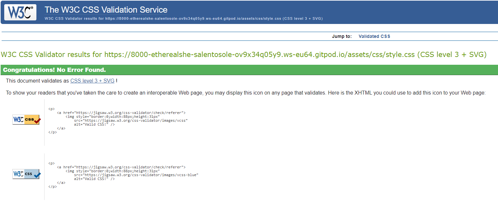

# Salentu: Sule, Mare e Ientu

[Visit the website here](https://etherealsheep.github.io/salento_sole_mare_vento/)

This site has been created with the idea of providing guidance and inspire people interested in visiting Salento.
Salento is becoming a very popular area all over the world. This website was made for educational purposes only.

This website consists of the following sections:
1. Home
2. Salento Life
3. Must See (A list of places not to be missed)
4. Contact Me (form to sign up to "Salentu, Sule, Mare e Ientu" newsletter)0

The business goals for this website are:

1. Provide an idea of what to find if you choose to visit Salento.
2. Inspire people traveling in Salento and encourage tourism.
3. Building a database, a network of contacts with users to send future information and contents.

The user goals of this website are:

1. For the first-time visitor: I want to give you an idea of the best places to visit and encourage trying local, typical food.
2. For the first-time user: I want you to be able to sign up to directly receive content via a newsletter.
3. For the recurring or first-time visitor: I want to find recommendations from a trusted source for restaurants/hotels/products.

---

## UX

### **Strategy**

Considering the core UX principles I first started to think about the strategy for this website and defined who the target users would be and what features/technologies they would want.

Salentu. Sule, Mare e Ientu target users are:
* Aged 18-60
* People interested in travelling
* Have an interest in visiting South Italy

What these users would be looking for:
* Clear, concise, easy-to-find information
* Beautiful photos that provide inspiration and make the destinations look desirable
* Recommendations about typical food

This website will offer all of these things whilst also allowing for intuitive navigation and comfortability of use. An effort was taken to not provide an overwhelming amount of information at first glance as this is often the reason people are put off with travel guides.

---

### **Scope**

In order to achieve the desired user & business goals, the following features will be included in this release:

- Header and menu bar, to navigate to various sections of the page
- Brief introduction about meaning of Salento, which is not a real region
- Information about Mediterranean climate and seasons
- Some tips about local food
- List of place to visit primarily
- Gallery of images from my last trip in Salento
- Newsletter sign up form
- Links to affiliate social media pages

---

### **Structure** 

This is a single-page website to allow for desired flow; the navigation bar at the top allows for users to easily move to whatever section of the site they are interested in or they can simply scroll through the information as it is displayed.
I chose the following order for the information 'Home > Salento Life > Must See > Contact Me', as I felt this would allow the information to be digested in the best way. There is a concise review of Salento at the beginning before providing some information about the local weather and food. After this, a gallery of pictures is provided to inspire future traveler and encourage old traveler to come back. The last section is a simple sign up form for users to sign up to the Salentu, Sule, Mare e Ientu newsletter.

[Wireframes](docs/Wireframe%20(Desktop).pdf)

asdasd

[Wireframes](docs/Wireframe%20(Mobile).pdf)

---

### **Appearance**

I chose a colour palette based around dark orange because this is a warm color and it reminds me of the warm temperature of Salento.
I want this to be helpful for the users to have a sense of what they will get travelling in a warm place like Salento.

---

## Technologies Used 

I have used several technologies that have enabled this design to work:

- [HTML](https://developer.mozilla.org/en-US/docs/Web/HTML)
    - Used as the basic building block for the project and to structure the content.
- [CSS](https://developer.mozilla.org/en-US/docs/Learn/Getting_started_with_the_web/CSS_basics)
    - Used to style all the web content across the project. 
- [Google Fonts](https://fonts.google.com/)
    - Used to obtain the fonts in the website.
- [Font Awesome](https://fontawesome.com/)
    - Used to obtain icons in the section "The Mediterranean"
- [Google Developer Tools](https://developers.google.com/web/tools/chrome-devtools)
    - Used as a primary method of fixing spacing issues, finding bugs, and testing responsiveness across the project.
- [GitHub](https://github.com/)
    - Used to store code for the project after being pushed.
- [Gitpod](https://www.gitpod.io/)
    - Used as the development environment.
- [Fancybox](https://fancyapps.com/fancybox/3/)
    - Used to format my Salento. Sule, Mare e Ientu photo gallery.
- [Lucidchart](https://www.lucidchart.com/)
    - Used to create Wireframes documents.
- [CSS Formatter](https://www.cleancss.com/)
    - Used to have a better CSS formatted code.
- [W3C Markup Validation Service](https://validator.w3.org/) 
    - Used to validate all HTML code written and used in this webpage.
- [W3C CSS Validation Service](https://jigsaw.w3.org/css-validator/#validate_by_input)
    - Used to validate all CSS code written and used in this webpage.

---

## **Features**
This webpage is fully responsive, designed to work with different devices and screen size.
The page is divided in four sections listed in the navigation bar.

### *Navbar*
It is positioned at the top of the page. The header image is bright and to keep it more visible, I opted for the orange backround of the navigation bar that was not extended to the full length of the page.

### *Home*
In this section, I provide the definition of Salento, which is not a real region in Italy and a tourist could be confused.
I wanted to keep this section very clean and easy to read using only an H2 element and paragraphs.

### *Salento Life*
This section is separated in two parts, with high contrast, to keep both parts clearly visible and understandable.
Also the structure is simple, the main DIV has been separated by two DIV elements: The Mediterranean and The Food; some icons added to make the text more captivating.
I wanted to give an idea about the lifestyle in Salento.

### *Must See*
This section includes a list of place to visit during a short trip, the most iconic and characteristic places to visit.
An high contrast with the rest of the webpage was chosento emphasize the importance and capture the attention.
To make the images more appealing the image gallery has been created with CSS grid and Fancybox.

### *Contact Me*
This is a signup form that will allow the user to sign up for the newsletter.
The form uses two text input, one email input and a submit button.
They are all required therefore all information is necessary to submit the form.
The colour pallet used is to keep consistency with the webpage.

---

### **Testing**

- I tested the webpage wth the following browsers: Chrome, Firefox, Safari, Edge
It works with all of them.
- I used devtools to test and confirm that this project is responsive, it looks good on all standard screen sizes.
- I tested and confirmed that the different sections are all readable and wasy to understand and navigate.
- I have tested and confirmed that the signup form works well: requires entries in every field and it only accept email in the email field.
The Submit button works.

---

### **Known bugs and fixes**

I did not find any bug during my work.

---

### **Lighthouse**

Lighthouse is a feature of Google Chrome developer tools and is used to assess the performance of the website and its features. I achieved the following result, as you can see below:

asdasdas

---

### **HTML and CSS Validation**

I validated both my HTML and CSS code multiple times whilst building the website. There were 0 errors found. 

asdasdasd

---

## Deployment

I deployed this website by using GitPages and following the below steps:

*GitHub pages deployment* 

1. Log in to GitHub
2. In your Repository section, select the project repository that you want to deploy
3. In the menu located at the top of this section, click 'Settings'
4. Select 'Pages' on the left-hand menu - this is around halfway down
5. In the source section, select branch 'Master' and save
6. The page is then given a site URL which you will see above the source section, it will look like the following: 

Please note it can take a while for this link to become fully active. 

*Forking the GitHub Repository*

If you want to make changes to your repository without affecting it, you can make a copy of it by 'Forking' it. This ensures your original repository remains unchanged.

1. Find the relevant GitHub repository
2. In the top right corner of the page, click the Fork button (under your account)
3. Your repository has now been 'Forked' and you have a copy to work on

*Cloning the GitHub Repository*

Cloning your repository will allow you to download a local version of the repository to be worked on. Cloning can also be a great way to backup your work.

1. Find the relevant GitHub repository
2. Press the arrow on the Code button
3. Copy the link that is shown in the drop-down
4. Now open Gitpod & select the directory location where you would like the clone created
5. In the terminal type 'git clone' & then paste the link you copied in GitHub
6. Press enter and your local clone will be created.

---

## Credits

I have used a number of resources to produce this website, where code has been used found from another source this is credited as a comment within the HTML, CSS and JS files.

The following website were used for research and guidance:

- [Wireframes](https://careerfoundry.com/en/blog/ux-design/wireframing-mobile-apps-websites/)

I used code from the following resources:

- [Responsive Navbar](https://www.w3schools.com/howto/howto_js_topnav_responsive.asp)

- [Image grid](https://www.freecodecamp.org/news/how-to-create-an-image-gallery-with-css-grid-e0f0fd666a5c/)

- [Fancybox gallery](https://fancyapps.com/docs/ui/fancybox/)

The below websites were used for the content: 

- The images in the website has been taken during my last trip in Salento.
- The image in the navigation bar, Villa Sticchi, is the only exception, because it is actually under renovation, I found an image from the internet.

---

## Acknowledgements

I would like to thank my course mentor Guido Cecilio for his support and guidance throughout the course of the project, he motivated and inspired me to do better and better.

---